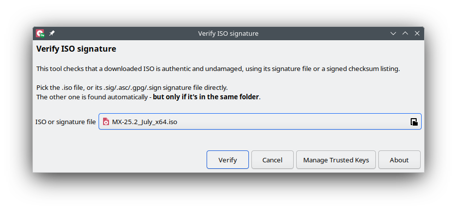
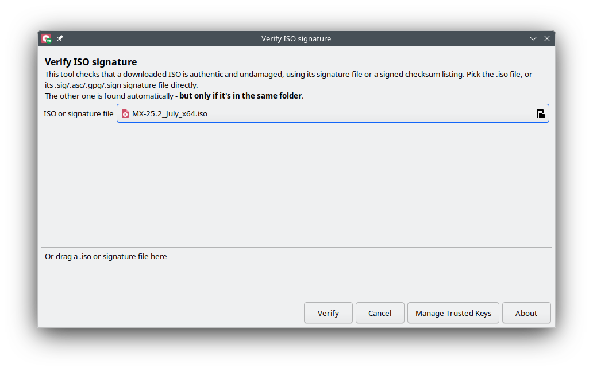

# ISO Signature Verifier

Check if a downloaded ISO file is really the original file, and not
changed by someone else - in just a few clicks.



## What is this?

When you download a Linux ISO (for example MX Linux, antiX, or
Debian), the makers also publish a small signed file next to it. This
signed file proves the ISO is genuine and was not changed on the way.

Checking this normally needs GPG commands and some GPG knowledge.
**ISO Signature Verifier** does this check for you, with one simple
window. No command line needed - but a command-line mode is there too,
for scripts.

## Main features

- Simple picker window: pick your ISO file, or its signature file. The
  tool finds the other one by itself, if it is in the same folder.
- Optional drag-and-drop mode (X11 only) - turn it on with
  `--drag-and-drop`, or the "Verify with Drag & Drop" entry in your
  application menu.
- Works with many distros: MX Linux, antiX, Debian, Ubuntu, Linux Mint,
  Fedora, openSUSE, Manjaro, and other distros that sign their ISO or a
  checksum list.
- Works on X11 and on Wayland.
- Comes with a list of well-known, trusted signing keys built in.
- Asks first before trusting a new, unknown key - and shows the Key ID
  and fingerprint, so you can check it yourself.
- A "Manage Trusted Keys" window to see, remove, or export/import the
  keys you already trust.

## Examples

Different distros publish their signature/checksum files a bit
differently - here's what to expect, using real filenames from
well-known distros. Whichever one of these files you pick, the tool
finds the other one(s) by itself, as long as they're in the same folder.

| You downloaded... | ...next to | What it is |
|---|---|---|
| `MX-25.2_July_x64.iso` | `MX-25.2_July_x64.iso.sig` | A direct signature - it signs the ISO itself. |
| `debian-live-13.6.0-amd64-cinnamon.iso` | `SHA256SUMS` and `SHA256SUMS.sign` | A checksum listing - the ISO's hash is one line in `SHA256SUMS`, which is itself signed by `SHA256SUMS.sign`. |
| `ubuntucinnamon-26.04-desktop-amd64.iso` | `SHA256SUMS` and `SHA256SUMS.gpg` | Same idea, different extension - some distros sign the listing with a `.gpg` file instead of `.sign`. |
| `lmde-7-cinnamon-64bit.iso` | `sha256sum.txt` and `sha256sum.txt.gpg` | Same idea again, different filename - the listing doesn't have to be called `SHA256SUMS` either. |
| `Fedora-KDE-Desktop-Live-44-1.7.x86_64.iso` | `Fedora-KDE-44-1.7-x86_64-CHECKSUM` | An inline-signed checksum listing - the whole file carries its own signature, no separate `.sig` needed. |
| `openSUSE-Tumbleweed-DVD-x86_64-Snapshot20260806-Media.iso` | `<same-name>.sha256` and `<same-name>.sha256.asc` | A per-ISO checksum - a small file with just this ISO's hash, signed separately. |

## How to use it

1. Open **ISO Signature Verifier** from your menu, or run
   `verify-iso-sig` in a terminal.
2. Pick your ISO file, or its signature file.
3. Click **Verify**.
4. The tool tells you if the signature is good or bad.


If the signing key had to be fetched fresh, you get one more question:
save it locally, so future checks with the same key don't need the
network again.


### Drag and drop, if you want it

The picker above is the same on X11 and on Wayland - just the file
field. Most people already have their file in hand (opened via a file
manager's "Open With", or by double-clicking the ISO/signature file
directly), so nothing extra is needed.

If you'd rather drag a file onto the window, turn on drag-and-drop
mode: run `verify-iso-sig --drag-and-drop`, or use the "Verify with
Drag & Drop" entry in your application menu (right-click the app's
icon, or its own menu entry, depending on your desktop). This adds a
drop area below the file field - available on X11 only, since it
needs a feature Wayland does not support; on Wayland it falls back to
the plain picker instead.



### Trusting a new key

If the tool does not already know the signing key, it asks you first.
You see the Key ID, the claimed identity, and the fingerprint, so you
can check them yourself before deciding to trust the key.


### Managing trusted keys


## Command line

For scripts and advanced use:

```
verify-iso-sig --cli <iso-file> [signature-file]
```

See `verify-iso-sig --help` or `verify-iso-sig --man` for the full list
of options.

## Build

This project builds a Debian package (`.deb`). To build it yourself,
clone this repository and run:

```
./build
```

It checks that everything needed to build is installed (`devscripts`,
for the `debuild` command - already there on MX Linux, antiX, and other
Debian-based distros, or install with `sudo apt install devscripts`;
plus anything else this package needs to build, listed in
`debian/control`) and tells you clearly what is missing, if anything.

You can also build it by hand instead: run `debuild -us -uc -b` from
the project root.

Either way, the finished `.deb` file (and a few related files) appear
one folder above the project root - that is where `debuild` always
places its output.

## About window


## License

GPL-3.0-or-later. See the `LICENSE` file for the full text.

## Authors

fehlix  
MX Linux development team
