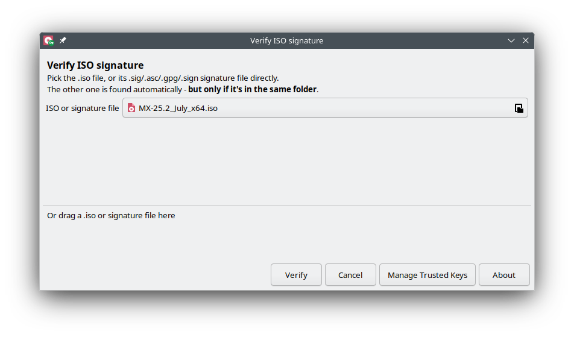
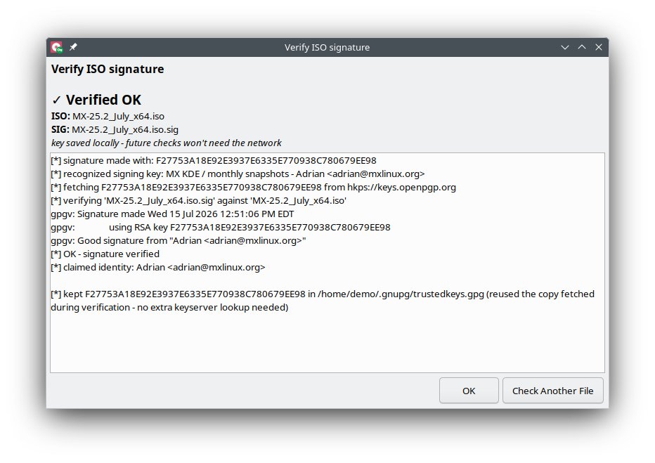
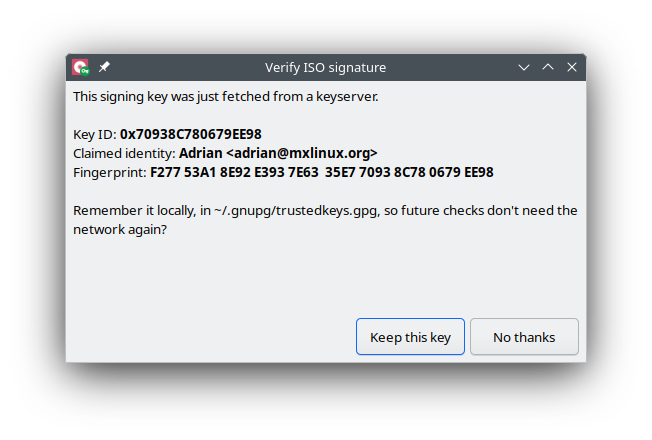
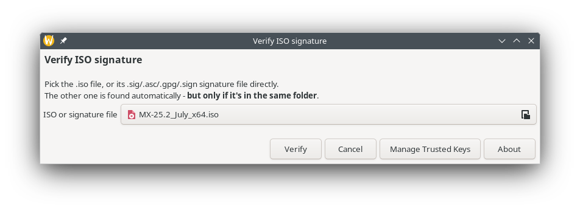
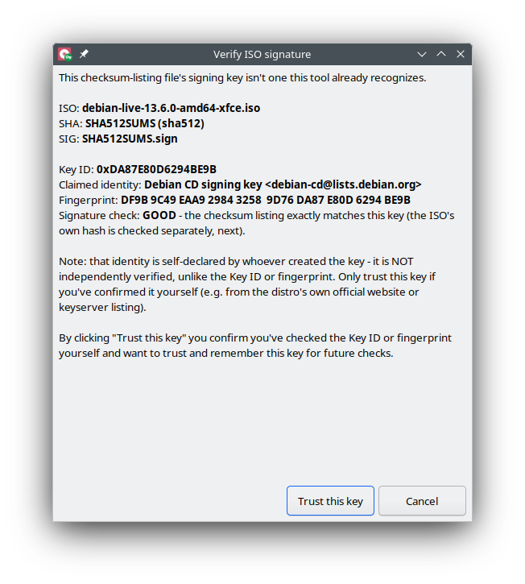
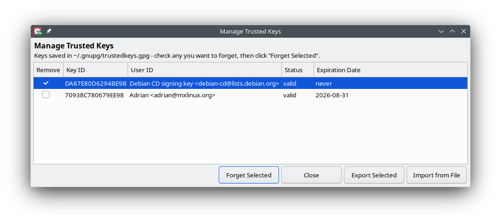
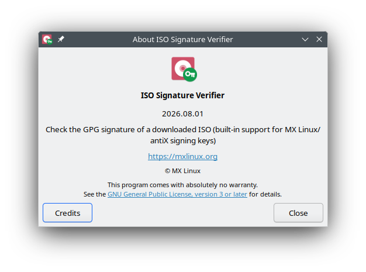

# ISO Signature Verifier

Check if a downloaded ISO file is really the original file, and not
changed by someone else - in just a few clicks.



## What is this?

When you download a Linux ISO (for example MX Linux, antiX, or
Debian), the makers also publish a small signed file next to it. This
signed file proves the ISO is genuine and was not changed on the way.

Checking this normally needs GPG commands and some GPG knowledge.
**ISO Signature Verifier** does this check for you, with one simple
window. No command line needed - but a command-line mode is there too,
for scripts.

## Main features

- Simple picker window: pick your ISO file, or its signature file. The
  tool finds the other one by itself, if it is in the same folder.
- Drag and drop support (on X11 desktops).
- Works with many distros: MX Linux, antiX, Debian, Ubuntu, Linux Mint,
  Fedora, openSUSE, Manjaro, and other distros that sign their ISO or a
  checksum list.
- Works on X11 and on Wayland.
- Comes with a list of well-known, trusted signing keys built in.
- Asks first before trusting a new, unknown key - and shows the Key ID
  and fingerprint, so you can check it yourself.
- A "Manage Trusted Keys" window to see, remove, or export/import the
  keys you already trust.

## How to use it

1. Open **ISO Signature Verifier** from your menu, or run
   `verify-iso-sig` in a terminal.
2. Pick your ISO file, or its signature file.
3. Click **Verify**.
4. The tool tells you if the signature is good or bad.



If the signing key had to be fetched fresh, you get one more question:
save it locally, so future checks with the same key don't need the
network again.



### X11 and Wayland look a little different

On an X11 desktop, the picker window (like the one at the top of this
page) also has a drag-and-drop area below the file picker, so you can
drop the ISO or signature file straight onto the window.

On Wayland, the drag-and-drop area is not there - the picker just shows
the file field. This is a Wayland limitation, not a missing feature:
the drag-and-drop window needs a feature that Wayland does not support.
Everything else (picking a file, verifying, trusting keys, managing
keys) works the same on both.



### Trusting a new key

If the tool does not already know the signing key, it asks you first.
You see the Key ID, the claimed identity, and the fingerprint, so you
can check them yourself before deciding to trust the key.



### Managing trusted keys



## Command line

For scripts and advanced use:

```
verify-iso-sig --cli <iso-file> [signature-file]
```

See `verify-iso-sig --help` or `verify-iso-sig --man` for the full list
of options.

## Build

This project builds a Debian package (`.deb`). To build it yourself,
clone this repository and run:

```
./build
```

It checks whether all components required for the build are installed 
(`devscripts`, for the `debuild` command; as well as any other 
components that this package needs for the build and that are listed in 
`debian/control`), and clearly shows you what might be missing.

You can also build it by hand instead: run `debuild -us -uc -b` from
the project root.

Either way, the finished `.deb` file (and a few related files) appear
one folder above the project root - that is where `debuild` always
places its output.

## About window



## License

GPL-3.0-or-later. See the `LICENSE` file for the full text.

## Authors

fehlix@mxlinux.org  
MX Linux development team
